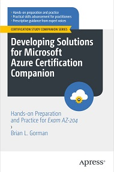

# Apress Source Code

This repository accompanies [Developing Solutions for Microsoft Azure Certification Companion: Hands-on Preparation and Practice for Exam AZ-204](https://www.link.springer.com/book/10.1007/9781484292990) by Brian Gorman (Apress, 2023).

[comment]: #cover

Download the files as a zip using the green button, or clone the repository to your machine using Git.

## Releases

Release v1.0 corresponds to the code in the published book, without corrections or updates.

## Contributions

See the file Contributing.md for more information on how you can contribute to this repository.

## TOC

The following TOC can help to direct you to specific README files for chapters where available (note that some chapters do not have README files):

### Part I: Develop for Azure

- Chapter 1: [Azure Storage Ecosystem: Overview and Development with Azure Blob Storage](ch01/README.md)
- Chapter 2: [Develop Solutions that use Azure Table Storage](ch02/README_Table.md)
- Chapter 2: [Develop Solutions that use Cosmos DB](ch02/README_Cosmos.md)

### Part II: Develop Azure Compute Solutions
- Chapter 3: No README file
- Chapter 4: [Create Azure App Service Web Apps](ch04/README.md)
- Chapter 5: [Azure Container Ecosystem: Azure Container Registry, Azure Container Instances, and Azure Container Apps](ch05/README.md)
- Chapter 6: [Implement Azure Functions](ch06/README_dotnet.md)
- Chapter 6: [Implement Azure Function - Isolated Runtime](ch06/README_dotnet-Isolated.md)

### Part III: Implement Azure Security
- Chapter 7: [Implement User Authentication and Authorization](ch07/README.md)
- Chapter 8: [Implement Secure Cloud Solutions](ch08/README.md)

### Part IV: Monitor, Troubleshoot, and Optimize Azure Solutions
- Chapter 9: [Azure Static Content](ch09/README_AzureStaticContent.md)
- Chapter 9: [Azure Caching and Content Delivery](ch09/README_Caching.md)
- Chapter 10: [Instrument Solutions to Support Monitoring and Logging](ch10/README.md)

### Part V: Connect to and Consume Azure Services and Third-party Services
- Chapter 11: [Implement API Management](ch11/README.md)
- Chapter 12: [Develop Event-based Solutions](ch12/README.md)
- Chapter 13: [Develop Message-based Solutions - Service Bus Queue](ch13/README_ServiceBusQueue.md)
- Chapter 13: [Develop Message-based Solutions - Service Bus Topics](ch13/README_ServiceBusTopics.md)
- Chapter 13: [Develop Message-based Solutions - Azure Storage Queue](ch13/README_AzureStorageQueue.md)
